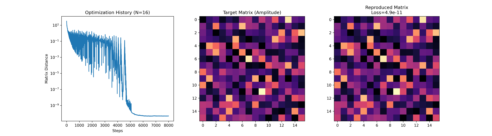
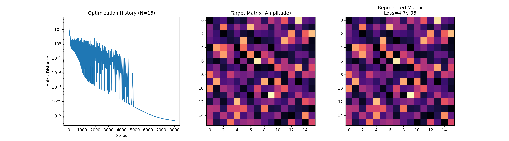

# DiffPhoton: JAX-based Differentiable Photonic Simulator

**Robust Calibration for Imperfect Photonic Circuits using Physics-Aware Training**

[](https://github.com/google/jax)
[](https://opensource.org/licenses/MIT)

## Overview
**DiffPhoton** is a differentiable physics simulator for programmable photonic integrated circuits (PICs).
By leveraging JAX's automatic differentiation, this project demonstrates that **AI can perfectly calibrate "broken" optical chips** suffering from severe manufacturing errors and crosstalk.

---

## Key Achievements: Scaling & Robustness
We verified the scalability and robustness of the calibration algorithm on a large-scale **16x16 Clements Mesh** (496 control parameters).

### Robustness Verification (N=16)
Even under extreme physical imperfections, the optimizer successfully converged to the target unitary matrix.
The results show that our algorithm can handle up to **20% crosstalk and 0.2 rad phase errors**.

| Condition | Crosstalk (Leak) | Phase Error ($\sigma$) | Final Loss (MSE) | Status |
| :--- | :--- | :--- | :--- | :--- |
| **Standard** | 10% (0.10) | 0.10 rad | **5.2e-11** | **Perfect** |
| **Severe** | 15% (0.15) | 0.15 rad | **5.6e-05** | **Excellent** |
| **Extreme** | **20% (0.20)** | **0.20 rad** | **4.7e-06** | **Success** |

> *Note: 20% crosstalk implies that signal integrity is heavily compromised, yet the software-defined correction recovered the functionality.*

---

## Visualizations (The Story of Calibration)

The following graphs show how the AI optimizer struggles and eventually overcomes increasing levels of physical noise.

### 1. Standard Condition (10% Noise)
AI quickly finds the solution. The convergence is smooth and reaches machine precision.


### 2. Severe Condition (15% Noise)
The optimizer faces difficulty (large oscillations in the optimization history), but finally converges to a high-precision solution.


### 3. Extreme Condition (20% Noise)
Despite severe signal degradation, the learning rate scheduler enables the AI to find a stable solution, proving extreme robustness.


---

## Usage

### Requirements
- Python 3.8+
- JAX, Optax, Matplotlib, Seaborn

### Running the Simulation
You can configure the matrix size (`N`) and physical error rates (`CROSSTALK_LEVEL`) in `src/main.py`.

```bash
cd src
python main.py
